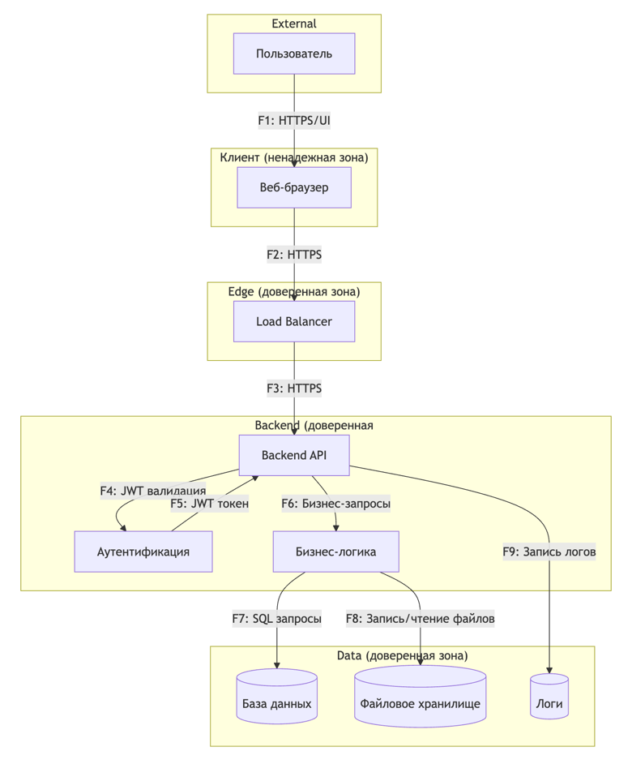

```
graph TD
    subgraph External
        A[Пользователь]
    end

    subgraph Client["Клиент (ненадежная зона)"]
        B[Веб-браузер]
    end

    subgraph Edge["Edge (доверенная зона)"]
        C[Load Balancer]
    end

    subgraph Core["Backend (доверенная зона)"]
        D[Backend API]
        E[Аутентификация]
        F[Бизнес-логика]
    end

    subgraph Data["Data (доверенная зона)"]
        G[(База данных)]
        H[(Файловое хранилище)]
        I[(Логи)]
    end

    A -- F1: HTTPS/UI --> B
    B -- F2: HTTPS --> C
    C -- F3: HTTPS --> D
    D -- F4: JWT валидация --> E
    E -- F5: JWT токен --> D
    D -- F6: Бизнес-запросы --> F
    F -- F7: SQL запросы --> G
    F -- F8: Запись/чтение файлов --> H
    D -- F9: Запись логов --> I
```
