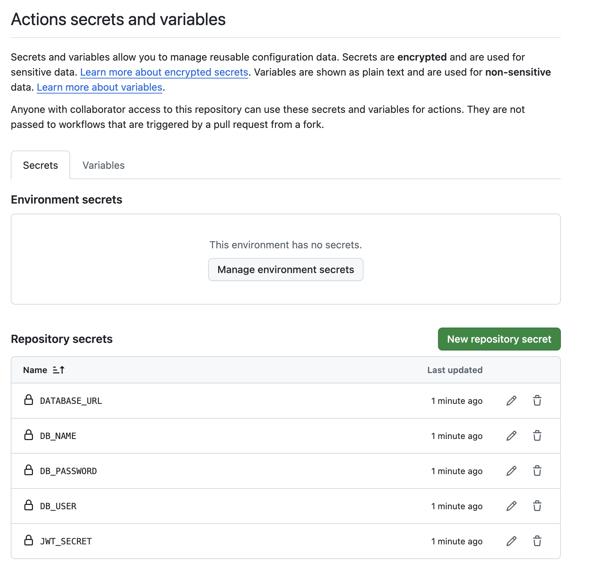
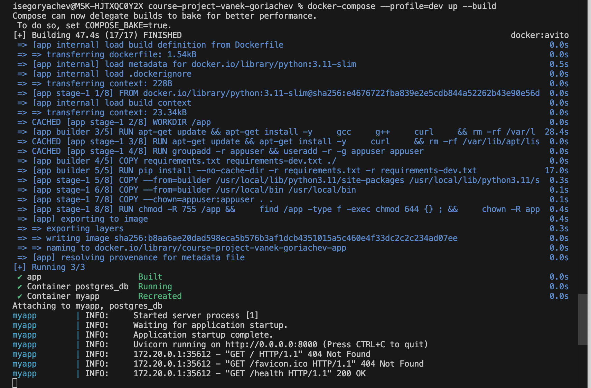

# p07

## Что сделано
- Добавлен CI

## Настройки репозитория

## Критерии (также они продублированы в комментах ниже)
C1. Сборка и тесты
★★2 - Матрица 3 версии Python + Ubuntu, кэш зависимостей, тесты + coverage

C2. Кэширование/конкурренси
★★2 - Concurrency настроен, кэш pip через actions/setup-python

C3. Секреты и конфиги
★★2 - Все секреты в GitHub Secrets, DB_URL, JWT_SECRET, разграничение через ${{ secrets }}

C4. Артефакты/репорты
★★2 - Тест-репорты (junit.xml), coverage отчеты (HTML+XML), артефакты релевантны

C5. CD/промоушн (эмуляция)
★1 - Эмуляция деплоя при пуше в main, базовый dry-run

Итог: 9/10 баллов

# P08

## Что сделано
Добавлена безопасность в контейнеры

## Критерии

### C1. Сборка и тесты
**★★ 2:** Настроена матрица (несколько версий Python/OS), кэш зависимостей и параллельные шаги под свой стек.

### C2. Кэширование/конкурренси
**★★ 2:** Оптимизированы ключи кэша под свой проект (по `requirements.lock`, `pyproject.toml`); слои Docker или gradle/npm кэш.

### C3. Секреты и конфиги
**★ 1:** Секреты вынесены в GitHub Secrets/Vars; вывод маскируется.

### C4. Артефакты/репорты
**★★ 2:** Артефакты релевантны своему проекту: docker-образ, wheel, HTML-отчёт тестов/линтеров; используются при релизе.

### C5. CD/промоушн (эмуляция)
**★ 1:** Настроен стейдж-деплой/эмуляция (dry-run, staging push).

## Пруфы что все завелось

